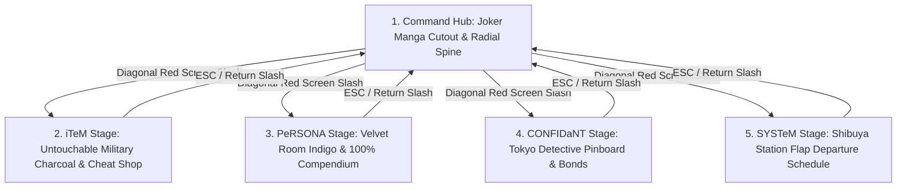

# Persona 5 Royal Save Editor — Authentic Atlus UI Overhaul Design Spec

**Date:** 2026-08-19  
**Status:** VALIDATED DESIGN SPEC  
**Goal:** Transform the web editor into an authentic, 1:1 Persona 5 Royal kinetic UI built directly from official game assets, distinct stage environments, and screen-slash transitions.

---

## 1. Core Architecture & Stage Director

Instead of static admin web pages, the frontend is controlled by a **Stage Director** that manages 5 distinct in-game environments:

---

## 2. The 5 Bespoke Stage Environments

### Stage 1: `COMMAND` (The Main Hub)
- **Visuals:** Centered on the authentic **Joker Manga Cutout** with crimson speed rays and pop-art halftone dots.
- **Ransom-Note Command Spine:** `SKiLL`, `iTeM`, `EQUiP`, `PeRSONA`, `StAtS`, `CONFIDaNT`, `SYSTeM`.
- **Live Save HUD:** Slanted bottom-left Yen display (`¥9,861,779`), active command spotlight box with ransom lettering.
- **Input:** Arrow keys / Mouse hover snap-tilt items with elastic physics (`cubic-bezier(0.175, 0.885, 0.32, 1.275)`).

### Stage 2: `iTeM` (The Cheat Shop & Master Catalog)
- **Theme:** Untouchable Military Charcoal & Takemi Clinic Acid Green.
- **Components:**
  - Independent 10-category pill bar (`Consumables`, `Skill Cards`, `Melee`, `Ranged`, `Protectors`, `Accessories`, etc.).
  - Character filter chips (`All`, `Joker`, `Skull`, `Mona`, `Panther`, `Fox`, `Queen`, `Noir`, `Oracle`, `Crow`, `Violet`).
  - Virtualized scroll list supporting all 2,204 knowable items (no 50-item cutoff).
  - Bulk cheat actions: `Own All Visible`, `Max Visible to 99`, `Add All Missing`.

### Stage 3: `PeRSONA` (The Velvet Room & Compendium)
- **Theme:** Velvet Royal Indigo (`#0B1B3D`), Electric Cyan (`#00F0FF`), and Gold Filigree.
- **Components:**
  - 246/246 Persona registration matrix with authentic Arcana cards (`C_CARD_URA.DDS`).
  - Level 99 stats, skill loadouts, and trait customization.
  - God-Tier preset fusion injector.

### Stage 4: `CONFIDaNT` (The Detective Pinboard)
- **Theme:** Shibuya Investigation Corkboard with Polaroid character cutouts and red string connections.
- **Components:**
  - All 23 Confidant ranks (1..10) with romance flags and affinity point meters.
  - Safety check lock for story-gated Confidants (Maruki, Akechi, Yoshizawa).

### Stage 5: `SYSTeM` (Rescue Vault & Steam Slot Terminal)
- **Theme:** Shibuya Station Split-Flap Departure Schedule.
- **Components:**
  - Steam slot detector (`DATA01`..`DATA16`, `SYSTEM.DAT`).
  - Automatic cryptographic checksum re-signing.
  - Snapshot rollback vault with timestamped backups.

---

## 3. Kinetic Animation & Asset Pipeline

1. **Authentic Assets:**
   - Textures sourced from `BASE.CPK` (`CAMP/HEROTEX`, `CAMP/CARDTEX`, `BUSTUP/TEXTURE`).
   - Authentic P5 ransom fonts and sound-effect clipboards.
2. **The Diagonal Slash-Cut Transition:**
   - Full-screen diagonal polygon sweep (160ms) accompanied by synthesized P5 audio snap.
   - Zero DOM thrash; 60fps hardware-accelerated CSS transforms.
3. **Responsive PC Layout:**
   - Locked viewport framing (`1280x720` baseline) that scales crisply to 1080p/1440p/4K without stretching.

---

## 4. Verification & Testing Plan

1. **Automated Visual Regression:**
   - Update `tools/capture_ui_state.py` to capture all 5 bespoke stage backdrops and verify zero visual glitches across monitors.
2. **Unit Test Parity:**
   - Retain 100% test pass rate (146/146 tests) on all backend save read/write routines.
